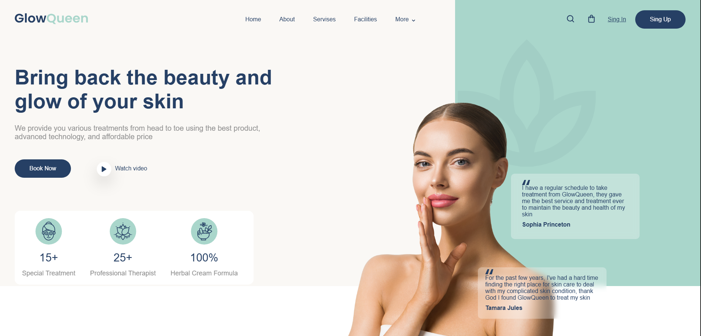

 
# 🌟 GlowQueen - Landing Page

**Descripción breve:**  
Este es un proyecto de landing page para una clínica estética ficticia llamada "GlowQueen". Fue diseñado como práctica en clase para trabajar el diseño visual, estructura HTML y estilos CSS, enfocándome en la estética limpia y profesional de una página moderna.

---

## 🌐 Ver página en vivo

👉 [Haz clic aquí para ver la landing page](https://matusbh.github.io/CSS-Tarea-entregable-1-Header-Spa-Beauty/)

---

## 🛠️ Tecnologías usadas

- HTML5  
- CSS3 (SCSS)

---

## 🚀 Características

- ✅ Layout limpio y estructurado  
- ✅ Tipografía y paleta de colores profesional  
- ✅ Sección testimonial con estilo moderno  
- ✅ Uso de iconos e imágenes decorativas  

---

## 📸 Captura del proyecto

---

## 📝 Notas adicionales

Este proyecto no incluye funcionalidades dinámicas ni interactividad con JavaScript, ya que el enfoque estuvo únicamente en la maquetación y el diseño visual estático.
